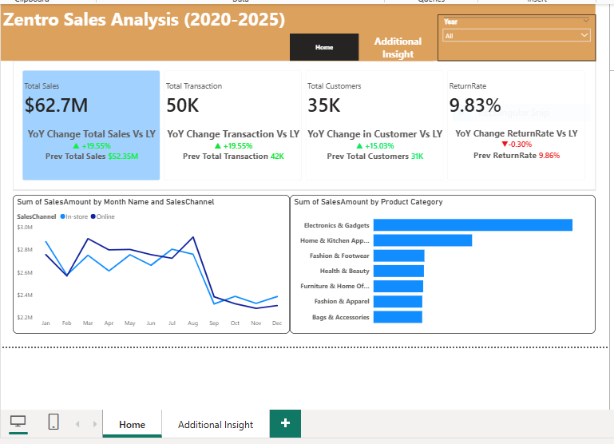
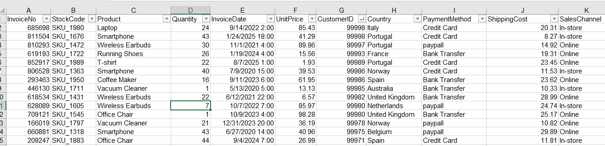

# Zentro Sales Performance Report (2020 - 2025)
## Analyzing transaction data of 5 years to optimize operations and reduce return rates using  Power BI 

 

 ## Executive Summary
 - The Management of Zentro do not have sufficient clarity of their level of transaction data which makes it difficult to track the performance across regions and product categories over the period of 5 years.
- Developed an interactive Power BI dashboard consolidating 49,000+ transactions to track KPIs, sales trends, and customer behavior.
- Delivered a centralized, data-driven reporting solution enabling stakeholders to track over $63M in sales, identify a 7.8% return-rate spike in 2023, and validate post-2023 policies. The analysis highlighted Electronics & Gadgets as the top revenue driver, balanced payment behavior, and the UK as a key growth market, guiding targeted marketing and regional strategy.

 ## The Business Problem
 Zentro requires a data-driven approach through simple statistical analysis and data visualization to have  full knowledge of their sales performance from January 2020 to September 2025. The aim of stakeholders is to make informed business decision by migrating from static reporting to dynamic view.

### Key Questions Addressed :  
- How have Key Performance Indicators (KPIs) changed YoY?
- Which product categories and regions are lagging?
- What are the preferred customer payment channels?

  ##  The Process (Methodology)
### Tools Used : 
 Power BI, Power Query, DAX
###  Data Sourcing & Overview
The dataset has up to 50,000 transactions which were cleaned using the available  and most suitable method to clean the data which brings it to a total of about 49,000 transactions which has 16 columns covering locations across all current locations.

### Data Cleaning & Transformation
Using Power Query, the raw data was transformed to ensure accuracy:
- Removed duplicate entries from the dataset.
- Corrected Product Category naming conventions and standardized Payment Method (e.g., renamed paypall to PayPal).
- Created a new SalesAmount calculated column.

  

  ## Analysis & Insights
  This section breaks down the data into actionable stories.
  
  ### Sales Growth & KPI Trends
  - Total sales is approximately $63M during the review period, with an average of approximately $11M annually.
  - Sales showed a slight decline of 0.00%  in 2022 compared to 2021, but recovered in subsequent years.
  - A significant finding was the return rate spike in 2023 (+7.8%).

  ### Product Category Performance
     Electronics & gadgets is the dominant category, totalling $3M in 2025 and exceeding the next closest category (Home & Kitchen Appliance) by $2M.

  ### Customer Behavior & Demographics
  - Customer preference is split almost perfectly in thirds: Credit Card (33%), Bank Transfer (33%), and PayPal (34%). This indicates a need to maintain robust support for all three gateways.
- The United Kingdom is the highest contributor to sales, generating approximately $1.3M in total revenue. All other countries contribute similar amounts, with total sales ranging between $575,000 and $700,000.

  ## Recommendations
   Based on the data analysis, I recommend the following actions for Zentro:
- The policies introduced in 2024 have successfully curbed the return rate spike observed in 2023 and should be standardized across all regions.
- Lessons should be drawn from the strong performance of the Electronics and Gadgets categories, as their success can be replicated across other product categories.
- Given that the United Kingdom contributes a significantly higher share of total sales, marketing efforts should be increased to strengthen and maintain market dominance in the country.
- Additionally, strategies driving sales success in the UK should be adapted and applied across other operating countries to ensure more balanced sales performance globally.
  
 
  [Interactive PowerBI Link](https://app.powerbi.com/view?r=eyJrIjoiMDc4YmFjOTMtOWY0Ny00ODJkLThiOGEtZmJhOTc5NzdhYWE1IiwidCI6IjY0M2NkODIwLWU2YzYtNGI2ZC05ZDc5LTJjOTgwOTllMTg3MCJ9)

 

